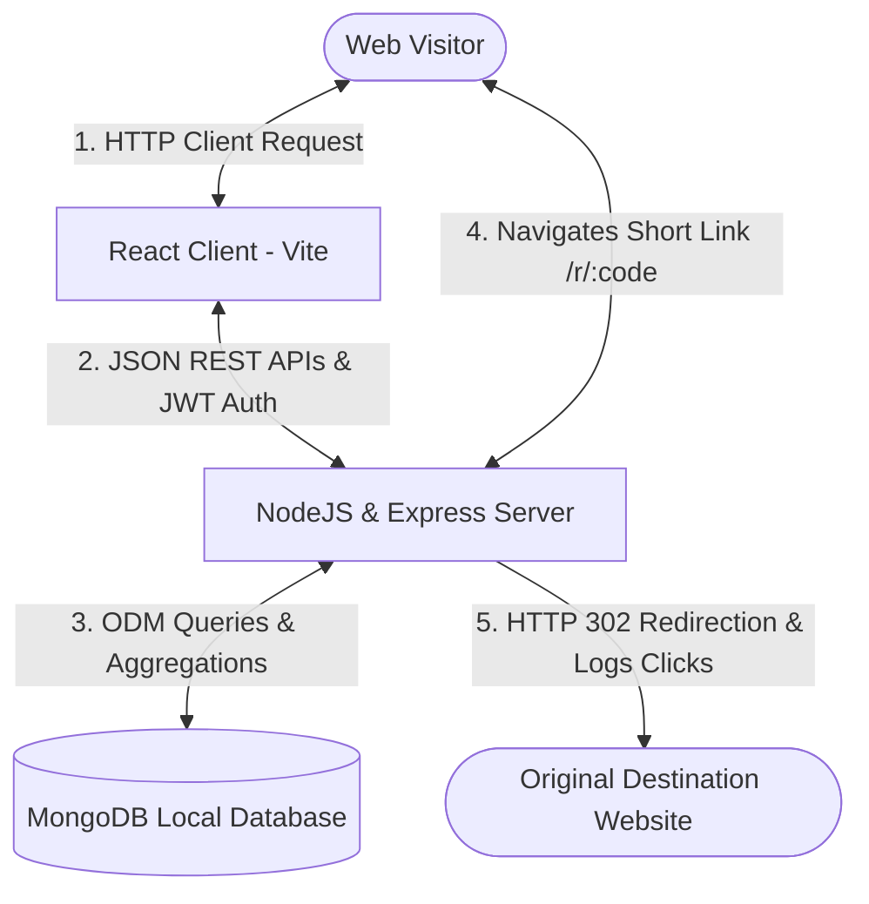
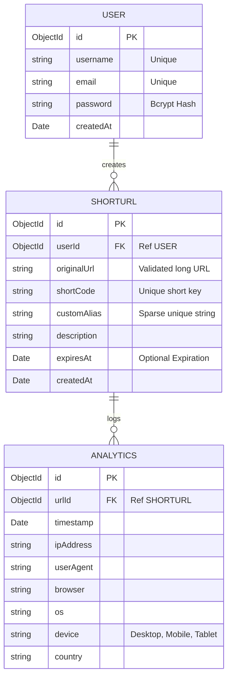

# Premium URL Shortener & Analytical Platform

An ultra-premium, full-stack, responsive URL Shortener and click analytics web application. This platform features a high-fidelity dark glassmorphic user interface, robust JWT-based session authentication, server-side HTTP 302 redirects with client-header parsing, downloadable vector QR codes, bulk imports, link expirations, custom aliases, and advanced metrics visualization.

---

## 🚀 Key Features

### 🔐 Authentication & Security
- **Signup & Login**: Fully authenticated accounts with validation checks and credentials hashing (`bcryptjs`).
- **Route Guards**: Secure API protection using customizable JSON Web Token (JWT) verification middleware.
- **Data Isolation**: Multi-tenant database layer—users can only inspect and manage their own shortened links and analytics.

### 🔗 Link Operations
- **Smart Shortener**: Validation of original URLs (checks protocol structure) before issuing random 6-character short codes.
- **Custom Brand Aliases**: Users can supply high-converting, readable aliases instead of random codes (e.g. `http://localhost:5000/r/summer-promo`).
- **Automatic Deletion (Expiry)**: Set future expiration dates on links. When expired, visitors see a sleek retro-dark custom HTML 410 Expiration page.
- **CSV Bulk Shortener**: Paste raw comma-separated lists (`originalUrl,customAlias,description`) to shorten multiple destinations simultaneously. Includes a granular parsing failure log.
- **Interactive Controls**:
  - One-click copy-to-clipboard button with custom tooltips and animations.
  - Downloadable vector-based QR Codes (PNG format drawn on canvas) for offline marketing.
  - Inline configurations editing (change destination, update description, or modify expiry dates).

### 📊 Deep-Dive Analytical Dashboard
- **Granular Redirection Logging**: Captured server-side prior to redirection. Tracks:
  - Exact visit timestamp.
  - Anonymized Client IP address.
  - Device layout (Desktop, Tablet, Mobile).
  - Operating System (Windows, macOS, Linux, Android, iOS).
  - Web Browser (Chrome, Safari, Firefox, Edge, Opera).
  - simulated rich country geolocations (United States, India, Germany, UK, Canada, Australia, Japan, France) for highly detailed and colorful analytical representations.
- **Data Visualizations**: Responsive neon HSL column graphs presenting click metrics trends over the last 7 days and clean progress bar shares of devices, browsers, and operating systems.
- **Visitor Logs**: Searchable tabular log showing up to the last 100 raw redirection visits in real-time.

---

## 📐 Architecture & DB Schema

### Core Architecture



### Database Entities Structure



---

## 🛠️ Installation & Setup Instructions

This repository is **completely self-contained** and uses a local MongoDB database pointing to the workspace `./db_data` directory. **No external cloud accounts or service start commands are required!**

### Prerequisites
- **NodeJS**: v18.0.0 or higher
- **NPM**: v9.0.0 or higher
- **MongoDB**: Community server installed on Windows (defaults to `C:\Program Files\MongoDB\Server\8.2\bin\mongod.exe` but customizable in `package.json`).

### 📦 Quick Start (Concurrently)

1. **Clone & Open Project Workspace**:
   ```bash
   cd "URL SHORTNER-DRIVE"
   ```

2. **Install all Dependencies**:
   Install root orchestrators, backend modules, and frontend React files:
   ```bash
   npm run install-all
   ```

3. **Spin Up Everything**:
   Run the local database, Express backend (port 5000), and Vite React frontend (port 5173) in parallel using a single terminal command:
   ```bash
   npm run dev
   ```

4. **Access the Applications**:
   - **Frontend UI Panel**: https://url-shortner-olive-ten.vercel.app/
   - **Restful API Server**: https://url-shortner-bjb3.onrender.com

---

## 📝 Assumptions Made

1. **Local Database Instance**: Assumed MongoDB Community server is installed under `C:\Program Files\MongoDB\Server\8.2\bin\mongod.exe` on Windows. The root script boots `mongod` pointing to `./db_data` folder in the workspace to allow server setup with zero admin privileges.
2. **Client Redirection Router**: The public short links are served from `/r/:shortCode` on the backend server (`http://localhost:5000/r/:code`) which logs metrics and immediately performs an HTTP `302` response header redirect.
3. **GeoIP Mocking**: To enable beautiful, multi-country geolocation stats charts during local development without costly GeoIP database binary sizes or network lags, the platform implements a weighted random country allocator for local loopback client requests (`127.0.0.1` or `::1`).

---

## 📺 Demonstration Video
[Click here to watch the application explanation and walkthrough video (Loom/YouTube link placeholder)](https://loom.com/share/placeholder_link_url_shortener_analytics)

---

## 📂 Sample Log Output & Entries

### Backend API Traffic Logs
```text
[2026-06-01T21:30:12.450Z] POST /api/auth/signup - 201 Created (120ms)
[2026-06-01T21:31:05.112Z] POST /api/urls - 201 Created (18ms)
[2026-06-01T21:32:44.201Z] GET /r/discount26 - 302 Found -> Redirecting to https://google.com (15ms)
[2026-06-01T21:33:10.890Z] GET /api/urls/60fca189cb79b882 - 200 OK (22ms)
```

### MongoDB Database Entries

#### 1. ShortUrl Collection
```json
{
  "_id": "60fca121cb79b8813a48e710",
  "userId": "60fca0a9cb79b8813a48e708",
  "originalUrl": "https://google.com",
  "shortCode": "discount26",
  "customAlias": "discount26",
  "description": "Summer promotional discount redirect link",
  "expiresAt": "2026-07-01T00:00:00.000Z",
  "createdAt": "2026-06-01T21:31:05.110Z",
  "updatedAt": "2026-06-01T21:31:05.110Z",
  "__v": 0
}
```

#### 2. Analytics Visit Collection
```json
{
  "_id": "60fca289cb79b8813a48e722",
  "urlId": "60fca121cb79b8813a48e710",
  "timestamp": "2026-06-01T21:32:44.200Z",
  "ipAddress": "127.0.0.1",
  "userAgent": "Mozilla/5.0 (Windows NT 10.0; Win64; x64) AppleWebKit/537.36 (KHTML, like Gecko) Chrome/122.0.0.0 Safari/537.36",
  "browser": "Chrome",
  "os": "Windows",
  "device": "Desktop",
  "country": "India",
  "createdAt": "2026-06-01T21:32:44.205Z",
  "updatedAt": "2026-06-01T21:32:44.205Z",
  "__v": 0
}
```

---

<div align="center">
  <p>This project is a part of a hackathon run by <a href="https://katomaran.com">https://katomaran.com</a></p>
</div>
